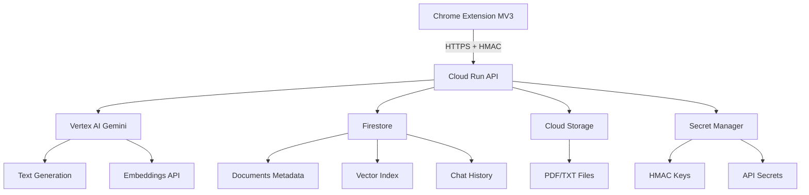

# 🪄 Magic Button - Extension Chrome MV3 + GCP Vertex AI

> **MVP complet d'extension Chrome connectée à un backend GCP serverless avec intelligence artificielle**

[](https://github.com/yassine/magic-button/actions)
[](https://cloud.google.com/run)
[](https://cloud.google.com/vertex-ai)

## 🎯 Vue d'ensemble

Magic Button est une extension Chrome moderne qui transforme votre navigation en assistant IA intelligent. Sélectionnez du texte sur n'importe quelle page web et laissez l'IA (Vertex AI Gemini) le corriger, résumer, traduire ou l'optimiser instantanément.

### ✨ Fonctionnalités principales

- 🔧 **Actions IA instantanées** : Corriger, résumer, traduire, optimiser du texte
- 🧠 **Recherche intelligente** : RAG (Retrieval Augmented Generation) avec votre base de connaissance
- 📚 **Upload de documents** : PDF/TXT vers votre base de connaissance personnelle
- 🎨 **Interface moderne** : React + TypeScript, mode sombre/clair
- 📱 **Responsive** : S'adapte à toutes les tailles d'écran
- 🔒 **Sécurisé** : Authentification HMAC, hébergement GCP

## 🏗️ Architecture technique



### 🛠️ Stack technologique

**Frontend (Extension Chrome)**
- Chrome Manifest V3
- React 18 + TypeScript
- Vite (build tool)
- Tailwind CSS
- IndexedDB (cache local)

**Backend (Cloud Run)**
- Node.js + TypeScript
- Fastify (framework web)
- Vertex AI SDK (@google-cloud/vertexai)
- Firestore SDK
- Cloud Storage SDK

**Infrastructure GCP**
- Cloud Run (serverless hosting)
- Vertex AI (Gemini 1.5 Pro + Embeddings)
- Firestore (NoSQL database)
- Cloud Storage (file storage)
- Secret Manager (secrets)
- IAM (security)

## 🚀 Installation et déploiement

### Prérequis

- Node.js 18+
- npm ou yarn
- Compte GCP avec facturation activée
- gcloud CLI installé et configuré

### 1. Setup local

```bash
# Cloner le projet
git clone https://github.com/yourusername/magic-button.git
cd magic-button

# Variables d'environnement
cp .env.example .env
# Éditer .env avec vos valeurs GCP

# Installation des dépendances
npm run install:all
```

### 2. Configuration GCP

```bash
# Exécuter le script de bootstrap GCP
chmod +x scripts/bootstrap-gcp.sh
./scripts/bootstrap-gcp.sh

# Ou déploiement via Terraform
cd infra/terraform
terraform init
terraform plan
terraform apply
```

### 3. Déploiement

```bash
# Backend vers Cloud Run
npm run deploy:backend

# Extension Chrome (mode dev)
npm run dev:extension

# Extension Chrome (production)
npm run build:extension
```

### 4. Installation de l'extension

1. Ouvrir Chrome → `chrome://extensions/`
2. Activer "Mode développeur"
3. Cliquer "Charger l'extension non empaquetée"
4. Sélectionner le dossier `extension/dist`

## 📖 Utilisation

### Actions IA rapides

1. Sélectionner du texte sur une page web
2. Cliquer sur l'icône Magic Button dans la barre d'outils
3. Choisir une action : Corriger, Résumer, Traduire, Optimiser
4. Récupérer le résultat IA instantanément

### Base de connaissance (RAG)

1. Uploader vos documents PDF/TXT via l'extension
2. Utiliser "Recherche intelligente" pour poser des questions
3. L'IA répond en se basant sur vos documents

## 🔧 Développement

### Structure du projet

```
magic-button/
├── README.md
├── docs/                    # Documentation technique
├── extension/              # Chrome Extension (React + Vite)
│   ├── src/
│   │   ├── popup/         # Interface principale
│   │   ├── content/       # Scripts d'injection
│   │   ├── background/    # Service worker
│   │   └── components/    # Composants React
│   └── manifest.json
├── backend/               # API Cloud Run (Node.js + TypeScript)
│   ├── src/
│   │   ├── routes/       # Endpoints API
│   │   ├── services/     # Services (Vertex AI, Firestore)
│   │   └── config/       # Configuration
│   └── Dockerfile
├── infra/                # Infrastructure as Code
│   ├── terraform/
│   └── scripts/
└── .github/workflows/    # CI/CD
```

### Scripts disponibles

```bash
# Développement
npm run dev                 # Lance tous les services en mode dev
npm run dev:extension       # Extension Chrome en mode watch
npm run dev:backend        # API backend en local

# Tests
npm run test               # Tous les tests
npm run test:unit         # Tests unitaires
npm run test:e2e          # Tests end-to-end

# Build et déploiement
npm run build             # Build complet
npm run deploy:backend    # Déploie le backend sur Cloud Run
npm run deploy:infra      # Déploie l'infrastructure Terraform

# Qualité code
npm run lint              # ESLint + Prettier
npm run type-check        # Vérification TypeScript
```

## 🧪 Tests

- **Tests unitaires** : Jest + @testing-library/react
- **Tests API** : Supertest
- **Tests E2E** : Playwright
- **Coverage** : >80% requis

```bash
npm run test:coverage     # Rapport de couverture
```

## 📊 Estimation des coûts GCP

**Usage quotidien estimé (développement)**
- Vertex AI (Gemini) : ~100 requêtes/jour → $0.50/jour
- Cloud Run : ~1000 requêtes/jour → $0.05/jour
- Firestore : ~500 opérations/jour → $0.02/jour
- Cloud Storage : ~10MB stockage → $0.001/jour

**Total estimé : ~$0.60/jour ou $18/mois**

## 🎓 Objectifs pédagogiques

Ce projet démontre la maîtrise de :

- ✅ **Architecture cloud-native** avec services managés GCP
- ✅ **Développement d'extensions Chrome** modernes (MV3)
- ✅ **Intégration Vertex AI** (Gemini + Embeddings)
- ✅ **Backend serverless** avec sécurité enterprise
- ✅ **RAG (Retrieval Augmented Generation)** avec recherche vectorielle
- ✅ **CI/CD** et déploiement automatisé
- ✅ **Documentation technique** professionnelle

## 📚 Documentation

- [📐 Architecture détaillée](./docs/architecture.md)
- [🎓 Plan pédagogique](./docs/pedagogy-plan.md)
- [📝 Journal HeurroDaga](./docs/heurrodaga-log.md)
- [🧠 Guide Vertex AI](./docs/vertexai-guide.md)
- [⚖️ Décisions techniques](./docs/decisions.md)

## 🤝 Contribution

1. Fork le projet
2. Créer une branche feature (`git checkout -b feature/amazing-feature`)
3. Commit vos changements (`git commit -m 'feat: add amazing feature'`)
4. Push vers la branche (`git push origin feature/amazing-feature`)
5. Ouvrir une Pull Request

## 📄 Licence

MIT License - voir [LICENSE](LICENSE) pour plus de détails.

## 🏆 Crédits

Développé par **Yassine** dans le cadre de sa formation GCP + IA.

Projet de formation technique : Extension Chrome + Backend GCP + Vertex AI + RAG.

---

*"From idea to production: a complete GCP-powered Chrome extension in 5 days"* ✨