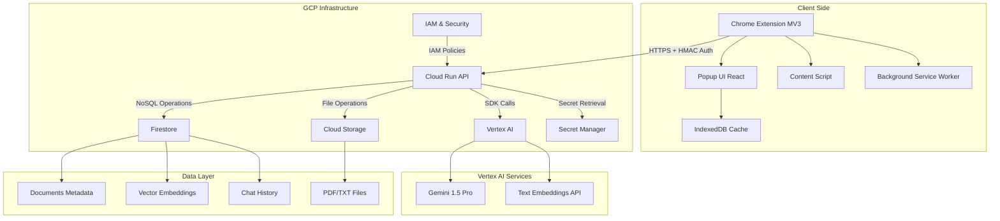
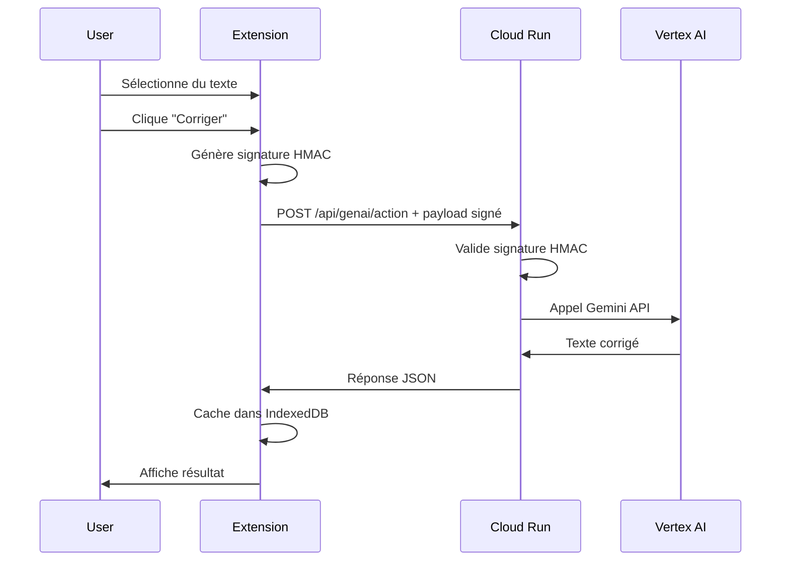
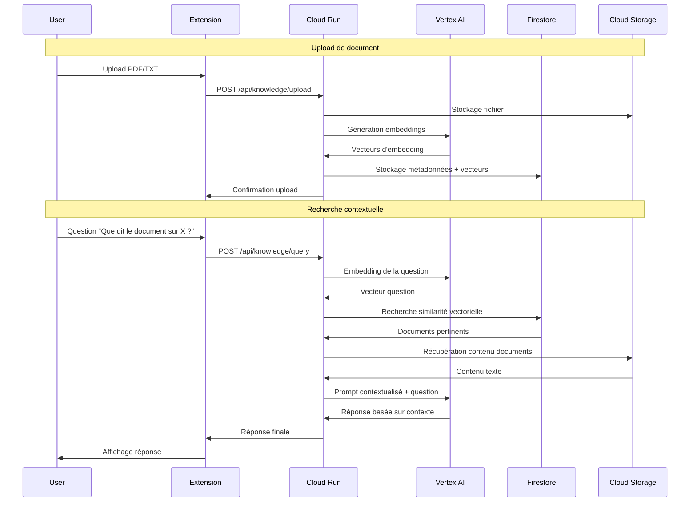

# 📐 Architecture technique Magic Button

## Vue d'ensemble

Magic Button utilise une architecture serverless moderne sur Google Cloud Platform, avec une extension Chrome comme interface utilisateur et un backend API gérant l'intelligence artificielle.

## Diagramme d'architecture



## Flux de données

### 1. Action IA Simple (Corriger/Résumer/Traduire)



### 2. RAG (Recherche dans la base de connaissance)



## Services GCP utilisés

### Cloud Run
- **Rôle** : Hébergement serverless de l'API backend
- **Configuration** :
  - Langage : Node.js 18 + TypeScript
  - Framework : Fastify
  - Auto-scaling : 0-10 instances
  - CPU : 1 vCPU, RAM : 2 GB
  - Timeout : 60s
- **Endpoints** :
  - `POST /api/genai/action` : Actions IA
  - `POST /api/knowledge/upload` : Upload documents
  - `POST /api/knowledge/query` : Recherche RAG
  - `GET /health` : Health check

### Vertex AI
- **Gemini 1.5 Pro** :
  - Génération de texte
  - Correction, résumé, traduction
  - Réponses contextuelles (RAG)
- **Text Embeddings API** :
  - Modèle : `text-embedding-004`
  - Dimensions : 768
  - Recherche sémantique

### Firestore (Native Mode)
- **Collections** :
  - `documents` : Métadonnées des fichiers uploadés
  - `embeddings` : Index vectoriel pour recherche
  - `chat_history` : Historique des conversations
- **Index** : Index composite sur les champs de recherche vectorielle

### Cloud Storage
- **Bucket** : `magic-button-documents`
- **Structure** :
  ```
  /documents/
    /{user_id}/
      /{document_id}.pdf
      /{document_id}.txt
  ```
- **Sécurité** : Accès via Service Account uniquement

### Secret Manager
- **Secrets stockés** :
  - `HMAC_SECRET` : Clé pour signature des requêtes
  - `VERTEX_AI_KEY` : Clé API Vertex AI (si nécessaire)
- **Accès** : Service Account avec rôle `secretmanager.secretAccessor`

## Sécurité

### Authentification HMAC
```typescript
// Génération côté extension
const timestamp = Date.now().toString();
const payload = JSON.stringify(data);
const message = `${timestamp}.${payload}`;
const signature = crypto.subtle.sign("HMAC", key, message);

// Headers HTTP
headers: {
  'x-mb-timestamp': timestamp,
  'x-mb-signature': signature
}
```

### IAM et Service Accounts
- **Service Account** : `magic-button-api@{PROJECT_ID}.iam.gserviceaccount.com`
- **Rôles** :
  - `aiplatform.user` : Accès Vertex AI
  - `datastore.user` : Accès Firestore
  - `storage.objectAdmin` : Accès Cloud Storage
  - `secretmanager.secretAccessor` : Accès Secret Manager

### Principe du moindre privilège
- Extension : Aucun accès direct GCP
- API : Accès limité aux ressources nécessaires
- Utilisateur : Pas d'accès direct aux données backend

## Performance et scalabilité

### Cache Strategy
- **Extension** : IndexedDB pour 50 dernières réponses
- **API** : Pas de cache (stateless pour simplicité)
- **TTL** : 24h pour le cache extension

### Limites et quotas
- **Vertex AI** : 60 requêtes/minute par défaut
- **Cloud Run** : Auto-scaling 0-10 instances
- **Firestore** : 10K opérations/jour (niveau gratuit)
- **Cloud Storage** : 5GB stockage (niveau gratuit)

### Monitoring
- **Cloud Run** : Métriques natives (latence, erreurs, instances)
- **Vertex AI** : Quotas et utilisation via Cloud Console
- **Logs** : Cloud Logging avec niveau configurable

## Déploiement

### Infrastructure as Code (Terraform)
```hcl
# Services principaux
- google_cloud_run_service
- google_firestore_database
- google_storage_bucket
- google_secret_manager_secret
- google_project_iam_binding
```

### CI/CD Pipeline
1. **Tests** : Jest (backend) + Playwright (extension)
2. **Build** : TypeScript compilation + Vite bundling
3. **Deploy** : gcloud run deploy + artifacts upload
4. **Smoke tests** : Vérification endpoints

## Coûts estimés

| Service | Usage/jour | Coût/jour | Coût/mois |
|---------|------------|-----------|-----------|
| Vertex AI (Gemini) | 100 requêtes | $0.50 | $15.00 |
| Cloud Run | 1000 requêtes | $0.05 | $1.50 |
| Firestore | 500 opérations | $0.02 | $0.60 |
| Cloud Storage | 10MB | $0.001 | $0.03 |
| **Total** | | **$0.57** | **$17.13** |

## Évolutions futures

### Phase 2 (optionnelle)
- **Multi-utilisateurs** : Authentification Google OAuth
- **UI avancée** : Interface web complète
- **Analytics** : Tracking usage et métriques business
- **Fine-tuning** : Modèles Vertex AI personnalisés

### Optimisations techniques
- **Cache Redis** : Pour réponses fréquentes
- **CDN** : Pour assets statiques
- **Vector DB spécialisée** : Pinecone ou Weaviate
- **Streaming responses** : Pour réponses longues